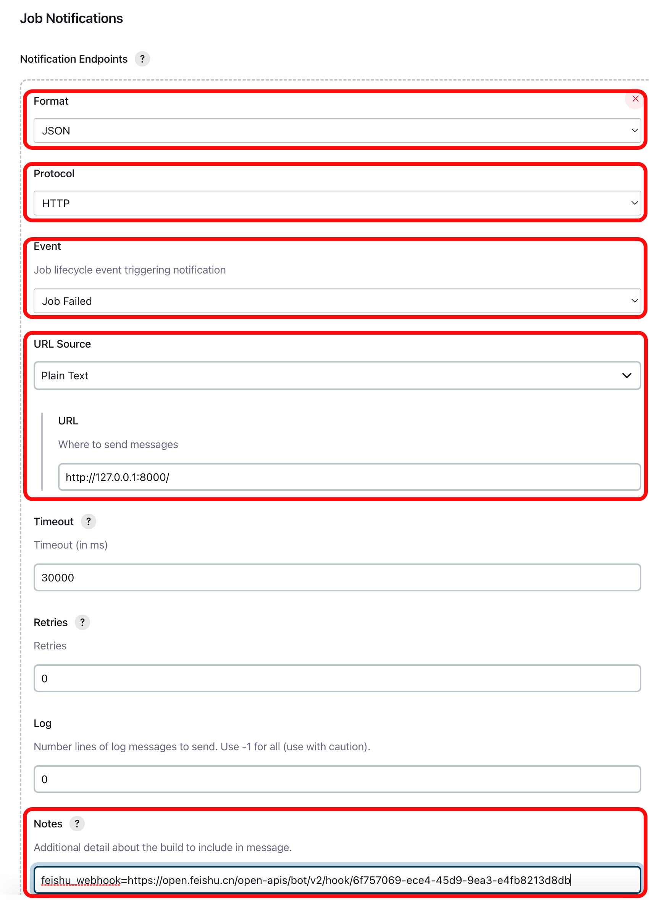

# Jenkins Notification Robot

This application can receive Jenkins build failure notifications (dependent on the [Notification plugin](https://plugins.jenkins.io/notification/)) and send the message to Feishu.

> You need to check if you have the [Token Macro](https://plugins.jenkins.io/token-macro/) and [Test Results Analyzer](https://plugins.jenkins.io/test-results-analyzer/) plugins installed, as these dependencies are not automatically handled when installing Notification plugins.

## 1. Useage

1. Run jenkins-notification-robot
   
    ```bash
    pip install -r requirement.txt
    python main.py
    ```

    The application will listen on 0.0.0.0:8000 port.

1. Set job like this:
   
    